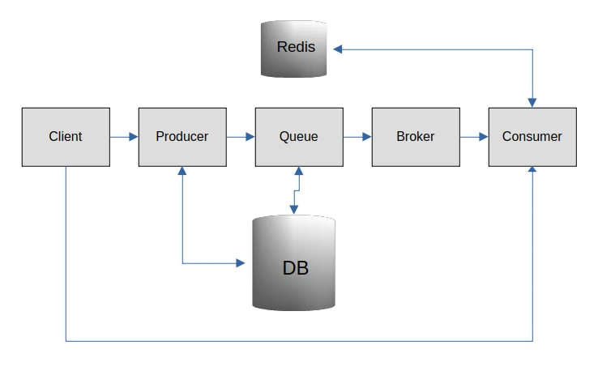

Микросервис доставки сообщений
==============================

В пакет входят код Docker Compose файл для развертывания сервисов в Docker, отдельно код приложения для Producer и код приложения для Consumer.  

## Архитектура решения

- `Producer` создает сообщения и передает их в очереди Laravel. Существуют две очереди - `normal` и `high`. В качестве primaryKey сообщения используется md5-hash, что гарантирует дублирование сообщений.
- Клиент посылает API запрос в consumer для создания сообщений в соответствующие топики - `normal` и `high`.
- Отдельный процесс мониторит сообщения в очереди и передает их брокеру Apache Kafka.
- Consumer забирает сообщения и эмулирует доставку провайдеру. Он также проверяет сообщение на идемпотентность с помощью redis.



## Установка

```sh
$ cd producer; composer install
$ cd consumer; composer install
```

## Запуск приложения

```sh
$ docker compose up -d
$ cd producer; php artisan serve
```

## API

| Entry                     | Parameters                    | Description                               |
|---------------------------|-------------------------------|-------------------------------------------|
| GET /api/clients          | -                             | Возвращает список клиентов                |
|                           |                               |                                           |
| GET /api/messages         |                               | Возвращает список сообщений               |
|                           |                               |                                           |
|                           | ?client_id                    | Фильтрация по клиентам                    | 
|                           | ?priority                     | Приоритет - normal, high                  |
|                           | ?status                       | created, queued, sent, delivered, error   |
|                           | ?channel                      | email, sms                                |
|                           |                               |                                           |
| POST /api/message/post    |                               | Создание сообщения                        |
|                           | client_id                     | массив id клиентов                        |
|                           | channel                       | email, sms                                |
|                           | priority                      | Приоритет - normal, high                  |
|                           | body                          | Тело сообщения                            |
|                           |                               |                                           |
| POST /api/message/status  |                               | Обновляет статус сообщения                |
|                           | message_id                    | id сообщения                              |
|                           | status                        | статус сообщения                          |
|                           | ?error                        | сообщение об ошибке, если есть            |
|                           |                               |                                           |
| GET /api/message/track    |                               | Возвращает историю состояний сообщения    |
|                           | ?message_id                   | id сообщения                              |

Для тестирования можно воспользоваться [коллекцией Postman](https://web.postman.co/workspace/My-Workspace~5713a214-9adc-4be9-8a00-0fdd04fec7b2/collection/6219940-4739d85c-ee6c-487c-baa1-2075a99de2e3?action=share&source=copy-link&creator=6219940)

## Тестирование

Функциональное тестирование производится внутри контейнера producer. Запутить тесты можно следующим образом:

```sh
$ ./shell.sh producer
$ php artisan test
```
